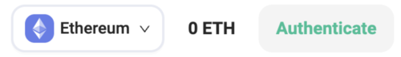
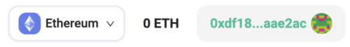
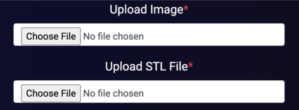
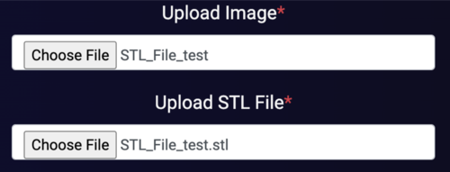
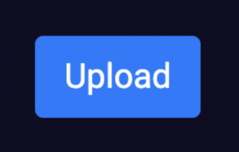
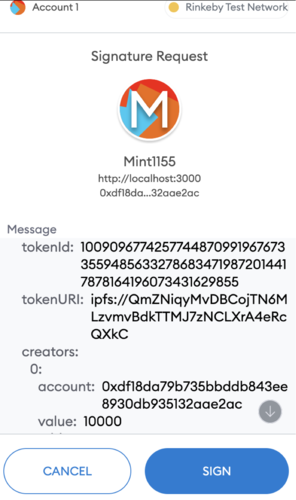

# Lazy Mint on Rarible

This tool allows a creator to upload a 3d printer file and list the NFT for sale on Rarible. The reason it is called "Lazy Mint" is that the NFT token is only minted when a buyer purchases the NFT. This is beneficial for the creator because it is free to list the NFT on the marketplace and the gas fee for minting is passed onto the buyer.  

---

## Prerequisites

To connect to the Ethereum blockchain and web3, a crypto wallet is required. A popular wallet is Metamask. Click the following [link](https://metamask.io/) to get a Metamask wallet and download the browser extension!

---

## Step 1 - Authenticate Wallet

After installing a crypto wallet, click on the Authenticate button on the top right of the page. Make sure you are on the Ethereum network.

After you click the Authenticate button, a pop-up window will appear from your crypto wallet asking you to sign the authentication transaction.

You will then see your wallet address display where the Authenticate button was and it will display your native blockchain balance for that blockchain in your wallet.

## Step 2 - Fill in Form Details

You will need to have your 3d printer file (STL is only supported right now) and image file (jpg/png) saved on your local computer before proceeding. 

Once you have the 3d printer file and image of the file ready, click on the "Upload Image" and "Upload STL File" buttons.

After choosing the appropriate files for the image and 3d printer file, the form fields will show the name of the selected files

and a preview of the image will appear to the right.

After uploading the image and 3d printer file, fill in the rest of the form fields.

Name = Name of the 3d printer file

Supply = Number of NFTs to create per 3d printer file

Category = The category the 3d printer file associates with

Creator = Your name or pseudonym 

Royalty = Percentage of every sale that you will collect after the first buy

Description (Optional) = Small description of the file and anything you think is important

## Step 3 - Upload Files to IPFS and list NFT for sale on Rarible

Once you have filled in all of the form fields outlined in step 2, click the "Upload Button"

A window alert fill appear after clicking the "Upload Button". This is a confirmation message that you want to proceed with the "Lazy Minting" process. Click the "OK Button" if you want to proceed.

PLEASE WAIT APPROX 15-30 SECONDS AND DON'T RESFRESH YOUR BROWSER. You will then see a pop-out window from your crypto wallet with your token id and metadata. Sign this message to proceed.

After you sign the message, PLEASE WAIT APPROX 15-30 SECONDS AND DON'T RESFRESH YOUR BROWSER. You will get another window alert.

Click "OK Button" to proceed and you will be redirect to the Rarible marketplace with your listing. You can then click the "Put on Sale" button and follow the Rarible steps to list your NFT.

