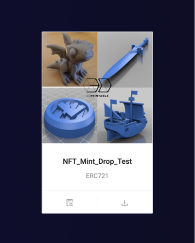
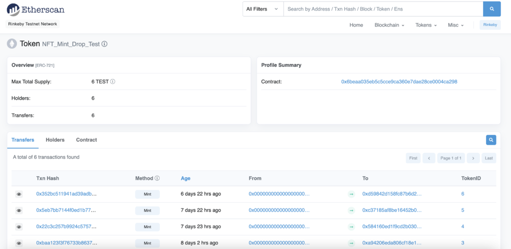
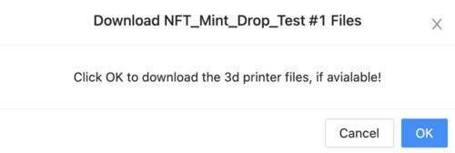

# Your Collection

This page shows the NFTs in your connected wallet. You can view the token contract on Etherscan and also download the 3d printer files belonging to your NFT, if applicable.

---

## Step 1 - View NFTs on Etherscan

If you have NFTs in your wallet, they will appear as cards in the body of the page as shown below.

You can then click the left button at the bottom of the card that says "View Token on Block Explorer" and you will be redirect to a page on Etherscan as shown below.

## Step 2 - Download 3D printer files

To download the 3d printer files, click the right button at the bottom of the card that says "Download Files, if available" and a modal will appear on your screen as shown below.

Click the "OK" button and the files will download onto your computer and you can save the files where you desire.